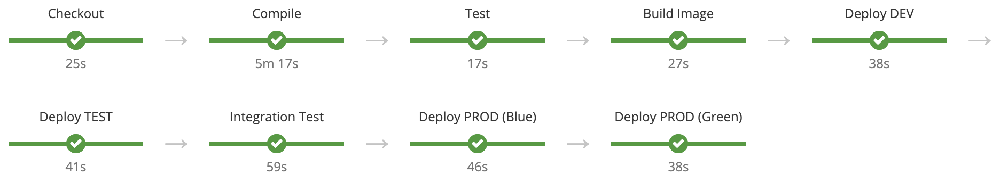

# OpenShift CI/CD Demo

Basic demonstration of OpenShift CI/CD pipelines for deploying applications across environments using advanced deployment strategies like Blue/Green.

## Pipeline

## Demo

### Create the environments (projects)

These are the environments where the applications will be promoted by the pipeline.

    oc new-project dev
    oc new-project test
    oc new-project prod
    
### Create a Jenkins instance

A Jenkins instances will be created in the development project.

    oc new-app --template=jenkins-ephemeral --name=jenkins -n dev

Then a set of permissions need to be granted.

    oc adm policy add-role-to-user edit system:serviceaccount:dev:jenkins -n test
    oc adm policy add-role-to-user edit system:serviceaccount:dev:jenkins -n prod

### Create the application (and the pipeline)

    oc new-app -f src/main/openshift/template.yaml -n dev -p APP_NAME=openshift-hello-world -p GIT_REPO=https://github.com/leandroberetta/openshift-cicd-demo.git -p GIT_BRANCH=master

### Start the pipeline

    oc start-build openshift-hello-world-pipeline -n dev

