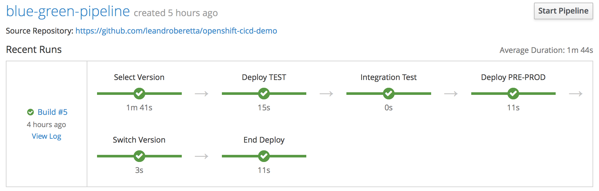
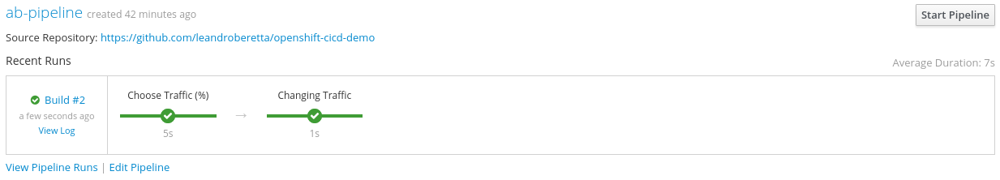
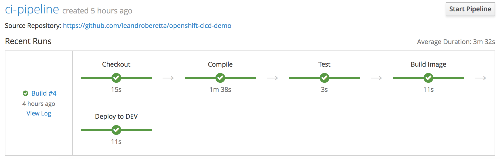
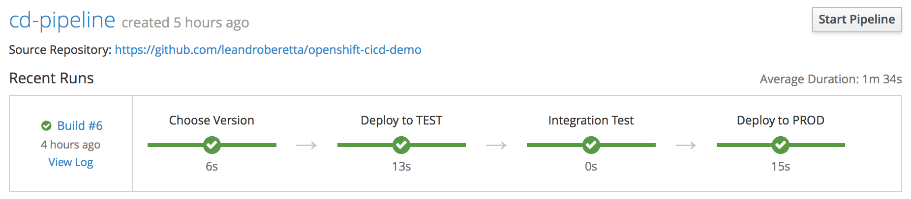

# openshift-cicd-demo

This repository contains a demo of the following OpenShift capabilities:

* **Blue-Green** deployments with zero downtime
* **A/B** deployments for experimental applications on production
* Integration with **Jenkins Pipelines**
* Continuous integration in Dev environment (**CI**)
* Continuous deployment (Basic, Blue-Green and A/B) in Test and Production environment (**CD**)

## Requisites

* An **OpenShift** cluster (3.5 or higher)
* The OpenShift CLI client (**oc**)
* Python 3.5 or higher (for testing the service) with requests library installed

## Usage

The demo can be be used in every cluster of OpenShift. The easiest way is to use **minishift**:

    minishift start

This repository contains a script called **demo.sh** to generate all the needed objects.

    sh demo/demo.sh

After the script execution the demo is ready to be used.

## Description

### Environments

The environments created are:

* Jenkins
* Dev
* Test
* Prod

## Pipelines

### Blue-Green Pipeline

### A/B Pipeline

### CI Pipeline (just for Dev deployments)

### CD Pipeline (deploys an specific image without building)

