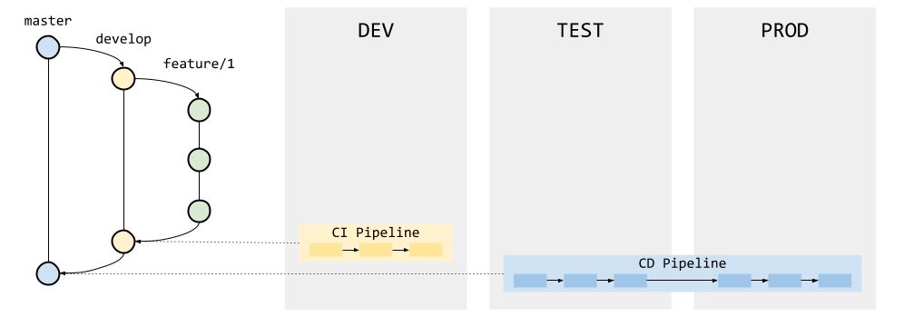
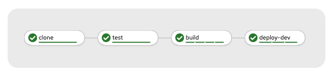
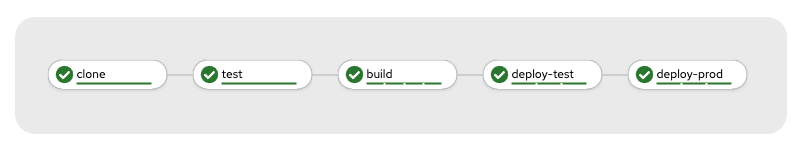

# OpenShift CI/CD Demo

Basic demonstration of an OpenShift CI/CD pipeline for deploying applications across environments.

## Pipelines

## Demo

### Prerequisites

* OpenShift 4.1 or higher
* OpenShift Pipelines installed in OpenShift

### Steps

#### Projects

Create the projects (environments):

    oc new-project hello-dev
    oc new-project hello-test
    oc new-project hello-prod

#### Pipelines

Create the tasks:

    oc apply -R -f ./tasks -n hello-dev

Create the pipelines:

    oc apply -R -f ./pipelines -n hello-dev

Create the triggers (webhooks):

    oc apply -R -f ./triggers -n hello-dev

Get the route for the webhook:

    export HELLO_EVENT_LISTENER_ROUTE=$(oc get route el-hello-event-listener -o jsonpath='{.spec.host}' -n hello-dev)

##### CI Pipeline (deploy to DEV building from develop branch)

A CI pipeline is started with a push event from the repository (Webhook). It can be simulated with the following command:

    curl -v http://$HELLO_EVENT_LISTENER_ROUTE \
    -H 'X-GitHub-Event: push' \
    -H 'X-Hub-Signature: sha1=37440a4ef68d5fe8266f71639363c826e7d753af' \
    -H 'Content-Type: application/json' \
    -d '{"head_commit": {"id": "develop"},"repository": {"url": "https://github.com/leandroberetta/openshift-cicd-demo"}}'

This action results in a PipelineRun:

##### CD Pipeline (Deploy to TEST and PROD building from master branch)

A CD pipeline is started with a pull request event from the repository. It can be simulated with the following command:

    curl -v http://$HELLO_EVENT_LISTENER_ROUTE \
    -H 'X-GitHub-Event: pull-request' \
    -H 'X-Hub-Signature: sha1=718db601d1071f5d7188c87a0b03240f84ed7dc5' \
    -H 'Content-Type: application/json' \
    -d '{"head_commit": {"id": "master"},"repository": {"url": "https://github.com/leandroberetta/openshift-cicd-demo"}}'

This action results in a PipelineRun:

        
